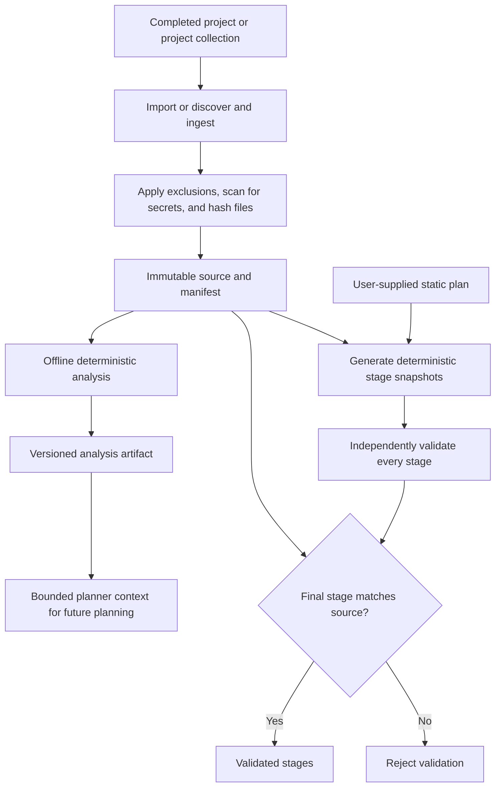

# Git Progressor

Git Progressor turns a completed software project into a reviewable sequence of logical
development stages and, in later milestones, publishes approved stages on a schedule. Its
central rule is simple: AI may suggest a plan, but deterministic Python reconstructs it,
and the final reconstructed tree must exactly match the imported project.

This repository currently implements deterministic stage generation and independent
final-state validation. It does **not** call OpenAI, commit, or push to GitHub.

## Requirements

- Python 3.11 or newer
- A local filesystem suitable for SQLite

## Install for development

```bash
python -m venv .venv
.venv/Scripts/activate       # Windows PowerShell
python -m pip install -e ".[dev]"
pytest
```

On Linux, activate with `source .venv/bin/activate`.

Copy `.env.example` to `.env` when custom paths are needed. Do not place API keys or Git
credentials in that file if it could enter version control.

## Current workflow



Planning, approval, scheduling, and publication are future milestones. Analysis does not
yet generate the static plan used for stage generation.

Import a completed project:

```bash
git-progressor import ./my-project
```

The command validates the directory, applies built-in exclusions and its `.gitignore`,
rejects symlinks and likely credentials, hashes every included file, copies it into a new
project directory, verifies the copy, writes `manifest.json`, and records the project in
SQLite. It prints the new project UUID on success.

Discover and ingest a collection of independent projects:

```bash
git-progressor ingest C:\Users\pilot\projects
```

`ingest` finds conservative project boundaries, imports new logical projects, recognizes
known revisions and moved or duplicated copies, and stores changed content as a new
immutable source revision. A failure in one candidate does not roll back other successful
imports; the command reports every outcome and exits non-zero when any candidate fails.

`sync` is intentionally not present yet. Its future meaning is reserved for actively
reconciling new revisions of known projects.

List imported projects:

```bash
git-progressor status
```

Analyze the latest immutable source revision, or select an exact revision:

```bash
git-progressor analyze PROJECT_ID
git-progressor analyze PROJECT_ID --revision SOURCE_TREE_HASH
```

Analysis is deterministic, offline, and metadata-only. It records languages, declared
dependencies, evidenced frameworks/tools, tests, configuration, infrastructure,
documentation, entrypoints, lightweight modules, selected important paths, statistics,
and explicit truncation warnings. It never executes project code or includes source text.

Generate snapshots from a static, strictly validated plan:

```bash
git-progressor generate PROJECT_ID --plan ./stage-plan.json
```

The plan is persisted at `planning/plan.json`. Later idempotent runs can omit `--plan`:

```bash
git-progressor generate PROJECT_ID
git-progressor validate PROJECT_ID
```

Each operation is `add`, `modify`, or `delete`. Added and modified bytes come either from
base64 embedded in the plan or a safe relative `source_path` in the immutable source.
Generation never executes plan content. A stage is built under a unique `.tmp-*` directory,
hashed, atomically renamed, and recorded in SQLite.

Validation rescans every snapshot without trusting the generator or stored hashes. It
rejects structural gaps, unexpected stages, symlinks, ignored metadata, credentials, and
manifest mismatches. It then compares the final snapshot with the independently rescanned
source by both individual path/hash entries and aggregate tree hash. Invalid results return
a non-zero exit code and never display file contents.

The following command remains deliberately inert. It returns exit code 2 and performs no
Git operation:

```bash
git-progressor publish PROJECT_ID --dry-run
git-progressor publish PROJECT_ID
```

## Intended workflow

```bash
git-progressor import PATH
git-progressor analyze PROJECT_ID
git-progressor plan PROJECT_ID
git-progressor show-plan PROJECT_ID
git-progressor generate PROJECT_ID
git-progressor validate PROJECT_ID
git-progressor approve PROJECT_ID
git-progressor schedule PROJECT_ID
git-progressor publish PROJECT_ID --dry-run
git-progressor publish PROJECT_ID
```

`plan`, `show-plan`, approval, scheduling, and publication remain future milestones.

## Data layout

```text
data/
├── git-progressor.db
└── projects/
    └── <uuid>/
        ├── manifest.json
        ├── source/
        ├── planning/
        ├── analyses/
        │   └── <source-tree-hash>/analyzer-v1/project-analysis.json
        ├── revisions/
        │   └── <source-tree-hash>/
        │       ├── manifest.json
        │       └── source/
        ├── stages/
        │   ├── 001/
        │   ├── 001.manifest.json
        │   └── ...
        └── state/
```

The source tree is authoritative. Import never mutates the input and never overwrites an
existing project directory. See [architecture](docs/architecture.md),
[security](docs/security.md), and [project format](docs/project-format.md).

## Security assumptions

The built-in scanner catches common credential filenames, private-key headers, AWS access
key IDs, and GitHub token formats. It is deliberately a first barrier, not a guarantee.
Later publication must rescan each exact stage with a mature scanner, keep SSH keys outside
project storage, retrieve secrets through AWS Secrets Manager or SSM, redact logs, and run
under a dedicated least-privileged account.

## Tree hashing

Every file is hashed with SHA-256 over its bytes. The tree hash feeds a second SHA-256 with
each file in sorted POSIX-path order as `path`, a NUL byte, the binary file digest, and a
final NUL byte. Timestamps, permissions, ownership, and directory entries are excluded.
A one-byte content change therefore changes both the file hash and tree hash.

## Project identity and revisions

The internal UUID identifies a logical project. A deterministic `source_identity` finds
that project again without using its absolute path. Where possible it hashes the marker
type and declared project name from bounded `pyproject.toml`, `package.json`, `Cargo.toml`,
`setup.cfg`, or `go.mod` metadata. Otherwise it hashes the normalized directory name and
marker set. The separate source tree hash identifies one exact content revision.

Exact revisions are recognized after moves and across duplicate copies. Changed content at
the last known location becomes a new revision. Declared identities also survive a move and
change together. A structural identity seen at a new path with different content is
reported as a conflict because the match is ambiguous.

## Analysis limits and planner context

The analyzer uses configurable file-count, per-metadata-file, cumulative metadata-byte,
and important-file limits. All ordering is canonical, and truncation is always reported.
`analysis_hash` is SHA-256 over canonical compact JSON excluding the hash field itself.

`PlannerContextBuilder` derives a smaller typed payload solely from the saved analysis. It
contains safe classifications and paths, not excerpts or raw repository contents. A future
planner can therefore consume bounded context without direct repository access.

## Roadmap

1. Extract artifact and state-store ports for local and future AWS adapters.
2. Add explicit plan review and approval commands around immutable analysis and plan versions.
3. Integrate the Responses API with strict structured output and redacted inputs.
4. Add publication manifests, scheduling, locking, and guarded Git publication.
