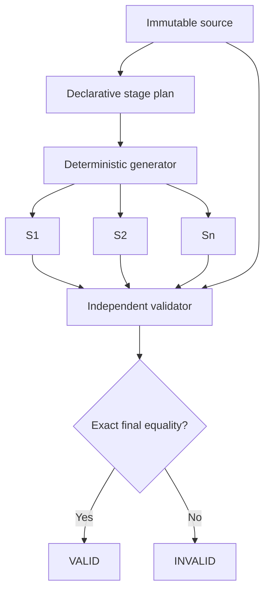

# Architecture

Git Progressor has two separately deployable conceptual subsystems. The Planner may use AI
to propose a structured plan, but it cannot access publishing credentials or Git push. The
Publisher consumes only approved, validated artifacts and never invokes AI.

```text
Completed project
      |
      v
Intake -> immutable source + manifest -> Planner port -> reviewed structured plan
      |                                      |
      |                                      v
      +----------------------------> deterministic stage snapshots
                                             |
                                             v
                              validator: final snapshot == source
                                             |
                                      human approval
                                             |
                                             v
                        publication manifest -> scheduler -> locked publisher -> Git
```

Collection ingestion adds an earlier deterministic layer:

```text
Local project root
        |
        v
Project discovery -> stable logical identity -> source revision hash
                                                |
                                                v
                                      existing safe importer
                                                |
                                                v
                                        immutable source
```

## Current milestone

Implemented: configuration, typed manifests and declarative plans, credential scanning,
`.gitignore` aware intake, verified source copying, canonical hashing, atomic full snapshots,
independent validation, SQLite stage state, CLI generation/validation, structured logging,
and inert Planner/Publisher ports.

Multi-project ingestion is also implemented locally. It records stable source identities,
last-seen paths, and immutable source revisions while preserving the original single-project
layout used by generation and validation.

Deterministic analysis selects one immutable revision and produces a version-addressed
`ProjectAnalysis`. Detection is based on filenames, extensions, bounded package metadata,
and conservative configuration evidence. It has no clock, randomness, network, process
execution, or AI dependency. Runtime creation timestamps live only in SQLite and are not
part of the artifact or its hash.

```text
Immutable revision -> bounded deterministic analyzer -> ProjectAnalysis
                                                       |
                                                       v
                                             PlannerContextBuilder
                                                       |
                                                       v
                                         future structured AI planner
```

The planner context builder reads only the typed analysis object. It cannot read source
files and currently includes no excerpts, making the AI input boundary explicit.

### Discovery boundaries

Discovery walks below, but does not treat, the collection root as a project. It accepts
directories with recognized build/package markers or README plus a source directory.
Dependency, build, VCS, environment, cache, and vendor directories are pruned. Once a parent
project is accepted, descendants are not considered separate projects. This topmost rule
avoids accidentally splitting monorepos and example applications.

### Identity and revision separation

`project_id` is the internal UUID. `source_identity` is a path-independent logical identity
derived from declared package metadata when available, otherwise from normalized basename
and marker signature. `source_hash` remains the canonical exact content fingerprint.
Migration 3 records every observed `(project_id, source_hash)` in `source_revisions`.

For backward compatibility, the first revision remains in `source/` and the legacy
`projects.source_hash` retains that first hash. Later revisions live below
`revisions/<source_hash>/`; `source_revisions` is authoritative for revision history.

Not implemented: provider calls, human approval, scheduling, locking, Git subprocess
execution, commits, pushes, and publisher workers.

## Core decisions

### Immutable source authority

Intake creates a new UUID directory and never overwrites it. Included files are copied as
bytes, rehashed after copying, and made read-only where supported. The manifest is the
source inventory. A future validator will independently rescan the source and compare the
last stage by path and byte digest. Operational deployments should additionally enforce
filesystem permissions or immutable object storage.

### Full stage snapshots

Stages are full directory snapshots. Each is assembled in a unique temporary sibling,
starting from the previous snapshot, then atomically renamed to its zero-padded number.
Its manifest is stored beside it. Existing stages are recomputed on regeneration and are
accepted only when they match their manifests. Content-addressed deduplication or patches
may later sit behind `SnapshotStore` without changing validation semantics.

### Independent validation

The validator never accepts the generator's hash as evidence. It walks the filesystem,
rejects symlinks and ignored metadata, reruns credential scanning, recomputes each manifest,
and compares it with persisted metadata. The final snapshot and immutable source are then
compared by path, size, individual file SHA-256, and aggregate tree hash.



### Strict AI boundary

`Planner` accepts a source path and manifest and returns `ProjectPlan`. Pydantic rejects
unknown fields, missing fields, non-contiguous stages, unsafe paths, and conflicting file
operations. The future OpenAI adapter must request JSON matching the generated schema. AI
output is a proposal only; Python performs every filesystem operation.

### Persistence and idempotency

SQLite begins in WAL mode with foreign keys enabled. A publication job is unique per stage
and records expected parent and resulting commit SHA. Recovery will reconcile the remote
HEAD before retrying, covering a crash after push but before the local success update.

### Publisher safety

The Git port intentionally contains no force-push method. A later implementation will
verify the configured remote, branch, clean worktree, expected parent, stage validation,
and credential scan before committing. Any uncertain state fails closed.

### Locking and future HA

The `ProjectLock` protocol isolates ownership. SQLite transactional locks are appropriate
for a single host. DynamoDB conditional writes can later implement the same lease contract
for multiple EC2 workers.

## Database schema

| Table | Purpose | Important constraints |
| --- | --- | --- |
| `projects` | Source identity and workflow status | UUID primary key, source hash |
| `source_revisions` | Immutable observed project revisions | Unique project/tree hash |
| `analyses` | Versioned deterministic analysis records | Unique revision/analyzer version |
| `plans` | Immutable structured plan artifact | References project, stores plan hash |
| `stages` | Ordered reconstructable states | Unique order, hashes, paths, audit timestamps |
| `repositories` | Approved remote/branch expectations | One per project |
| `publication_jobs` | Scheduled idempotent work | One job per stage |
| `publication_history` | Append-only attempt audit | Parent/result SHA and outcome |
| `locks` | Current project lease | One owner per project |
| `schema_migrations` | Applied migration versions | Integer primary key |
